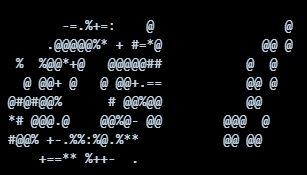

# Text-to-ASCII Diffusion Model

A diffusion model that generates ASCII art representations of MNIST digits using a transformer-based denoising architecture.

## Example Outputs

Here's an example of digits 0 and 1 generated with **CFG Scale = 7.0, Temperature = 0.1**:



### Model Parameters

**Architecture:**
- Grid: 20×10 (200 tokens)
- Embedding: 128-dim, 4 transformer layers, 8 heads
- Feed-forward: 256-dim

**Diffusion:**
- Timesteps: 400 (iterative denoising steps; more steps = higher quality but slower generation)
- Beta schedule: noise variance range of (1e-4, 2e-2) with cosine to provide smoother transitions than linear scaling

**Training:**
- Batch size: 16, Epochs: 40
- Learning rate: 4e-4, Gradient clip: 1.0 (clips any gradient with norm >1.0 to prevent training instability)

**Classifier-Free Guidance:**
- CFG scale: 3.0 (training), Drop prob: 0.1
- Auxiliary CE loss weight: 0.45 (ratio of token cross-entropy loss alongside MSE to balance discrete token selection with soft distributions)

---

## Prerequisites

This assumes you have Docker installed and an Nvidia GPU, but you easily swap the image base to use a ROCm image and run with an AMD GPU.

## Build and Run Docker with Nvidia GPU

Build the container:
```bash
docker build -t ascii-diffusion .
```

Run with GPU access:
```bash
docker run --gpus all -it --rm \
  -v $(pwd):/workspace \
  -p 8888:8888 \
  ascii-diffusion
```

## Prepare MNIST Data

Download MNIST data and convert images to ASCII art:

```bash
python data.py --out ascii_full --width 20
```

Options:
- `--out`: Output directory for processed data
- `--width`: ASCII art width (default: 80)
- `--limit-train`: Limit training samples (optional)
- `--limit-test`: Limit test samples (optional)

This generates `train_manifest.jsonl` and `test_manifest.jsonl` with ASCII art file paths.

## Train with Jupyter Notebook

### Option 1: JupyterLab
Start JupyterLab:
```bash
jupyter lab --ip=0.0.0.0 --port=8888 --no-browser --allow-root
```

### Option 2: VSCode
Open `diffusion.ipynb` directly in VSCode with the Jupyter extension.

### Training
Run cells sequentially in `diffusion.ipynb` to load, train, and run inference with the model.

The notebook trains a transformer-based denoiser and samples ASCII art for digits 0-9.

## Next Steps

The next phase is to scale this approach to broader image datasets:

1. Generate ASCII art labels for diverse image datasets
2. Train a text-conditioned diffusion model on text→ASCII pairs (likely single words at first)
3. Enable text-to-ASCII generation for arbitrary subjects and scenes
