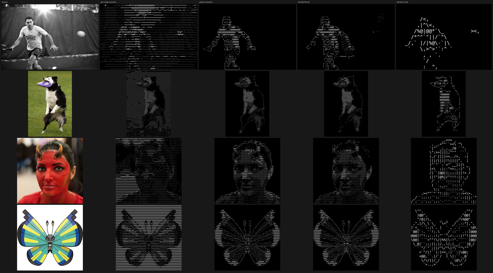

# AsciiNet

Turn **any image** — or a **text prompt** — into ASCII art that people can actually recognize, at
any size from a 16-column thumbnail to a full terminal.


<sub>Left to right: original · `ascii-image-converter` (what the old dataset used) · the hand-built
pipeline (AsciiNet's teacher) · **AsciiNet at 80 columns** · **AsciiNet at 32 columns**. Held-out images.</sub>

```
$ python ascii.py -p "a steaming cup of coffee" -w 64
                                _
                               _|
                             _/)\,
                             `) |^_
                            ||/ ^,^,
                            \|\  ^\|\
                             \|\   \/
                              `,\  /
                               |`
                   _.><^^^`````` ````^^>><._
                 /``<_.><^^^^`````^^^^>><._`,\;
                 |><|<<.,____@@@@@____,,.><><^|_.<>><_
                 |||||``^^^^>>>>>><^^^^``|||||@@_><<_|\
                 |||||||||:::::::::::::::::|||@,`   ^@|/
                 |||||||:::::::::::::::::::::@@`     @|\
                 ^||||||::::::::::::::::::::\@/    _'@/
                  \|||||::::::::::::::::::::@|__,>^`_/
                   ,|||||::::::::::::::::::|@@@@_.<^
           _.>^^`   \||||||::::::::::::::|@_><^`  _
         /`          \_||||::::::::::::||_/        `^<
         _            |@|||||:::::||||@@/`            |
         `<>._      ``^<_@>@@,|_|,,@@_>^           ,</`
            `^<`^>><.,,__`^^^>>>><<^^   __,,.>>_^><`
                  `^><.,___```````````___,.><^`
                          ````^^^^````
```

## Quick start

```bash
./setup.sh                 # creates the `ascii` conda env (Python 3.12, PyTorch 2.13 + CUDA 13)
conda activate ascii

python ascii.py photo.jpg                     # fits your terminal width
python ascii.py photo.jpg -w 24               # small outputs work too
python ascii.py photo.jpg -w 120 --color      # 24-bit color characters
python ascii.py https://example.com/cat.png   # URLs and '-' (stdin) work too
python ascii.py photo.jpg --background light  # for white pages / light terminals
python ascii.py -p "a lighthouse on a cliff"  # text -> picture -> ASCII
python ascii.py photo.jpg -o art.txt --png art.png
```

```python
from asciiart.neural import NeuralConverter
from asciiart.pipeline import Options
net = NeuralConverter()                        # checkpoints/asciinet.pt, else the released weights
print(net.text("photo.jpg", Options(cols=100)))
```

Images need only the 112 MB AsciiNet weights: **13 ms per image at 32 columns, 24 ms at 80,
0.3 GB VRAM** on an RTX 5080. They are downloaded from
[SamuelReeder/asciinet](https://huggingface.co/SamuelReeder/asciinet) on first use, unless you
trained your own (`checkpoints/asciinet.pt`, see *Reproducing*). If neither is available, the CLI
falls back to the pipeline engine (~110 ms and 1.6 GB per image, plus BiRefNet and SigLIP, ~1.2 GB
downloaded from Hugging Face on first use).
Prompts also use SANA-Sprint 0.6B with its Gemma-2-2B text encoder (~7 GB download; ≈9 GB peak
VRAM while encoding the prompt, ≈4 GB after) and SigLIP. Everything also runs on CPU, slower.

## How it works

```
 text prompt ─► SANA-Sprint 0.6B (2 steps, 1024 px), 4 candidates ─┐   SigLIP keeps the candidate
                                                                    │   whose *ASCII* best matches
 image ─────────────────────────────────────────────────────────────┤   the prompt
                                                                    ▼
                           AsciiNet (ours, 28M parameters, trained from scratch) ─► one glyph per cell
```

### AsciiNet

A PyTorch network trained from random initialization (`asciiart/model.py`). It picks one of 26
letter-free glyphs ` .:-=+*#%@|/\_()<>^,'`;~"!` for every character cell, in one forward pass:

```
context image (~384 px) ─► ConvNeXt stages ─► 6 transformer blocks ─► FPN ─► subject map (aux loss)
                                                                        └─► context features ─┐
grid image (8x16 px per cell) ─► conv stages ─► per-cell features ────────────────────────────┤
exact cell pixels ──────────────────────────────────────────────────► per-cell features ──────┤
options (dark/light background, invert, focus) ─────────────────────► embedding ─────────────┤
                                                                                              ▼
                                     6 cell-level ConvNeXt blocks (stroke continuity) ─► glyph logits
```

* **Any output size, including tiny ones.** The context branch always sees the whole picture at
  ~384 px, whatever the grid size, so a 16-column output still knows what the subject is and what
  to leave out. The grid branch sees every pixel of every cell, so strokes follow fine structure.
  Everything after the context branch is convolutional over the grid: one model serves every width.
* **No subject-matting model at inference.** The context branch learned subject focus itself
  (an auxiliary head predicts the subject map), so AsciiNet replaces BiRefNet (a Swin-L
  segmentation model run at 1024 px), edge detection and glyph search with a single 28M-parameter pass.

**Training** (`scripts/train.py`) distills the hand-built pipeline below into the network:

* Every training step draws a grid width **log-uniformly from 16 to 128 columns** (half of all
  batches are ≤45 columns) and an aspect ratio from 0.5 to 1.8, then random crops, flips, color
  jitter, gamma, grayscale, inversion, blur and JPEG artifacts.
* The pipeline labels each augmented crop **on the fly on the GPU** (batched; BiRefNet's subject
  mattes are computed once per image and cached, `scripts/cache_mattes.py`), so the labels always
  match the augmentation and the grid size.
* Loss: cross-entropy against soft targets (10% label smoothing toward visually similar glyphs,
  so `/` for `(` costs less than `@` for `(`), plus subject-map BCE and per-cell ink L1 as
  auxiliary losses. AdamW, cosine schedule, bf16, EMA of the weights.
* This run: 30k steps from random initialization, then 20k more with the subject-map losses
  up-weighted (`--init ... --matte-w 1 --dice-w 0.5`), which raised the subject map's median IoU
  against BiRefNet from 0.72 to 0.80 and the VLM score at 80 columns from 0.28 to 0.33. About 0.34 s per
  step, ~4.7 h in all on one RTX 5080, 10 GB VRAM. On held-out images the network picks the teacher's
  glyph for 75% of cells at 24 columns and 81% at 80 (58% / 65% of the non-blank cells).

### Training data: 46 sources, 187k images

`scripts/download_data.py` + `scripts/prepare_data.py` (public Hugging Face datasets; sources are
sampled ∝ √size so small domains are seen often). 97k of them (up to 3,000 per source, 8,000 for
ImageNet) have cached mattes and are used for training.

| kind | sources |
|---|---|
| photos: objects | ImageNet (64k), COCO, Pascal VOC, Stanford Cars, FGVC Aircraft, Oxford Pets, Flowers-102, Food-101, product photos |
| photos: scenes | SUN397, Country211 geo photos, KITTI driving, aerial (RESISC45), satellite (EuroSAT) |
| people & faces | CelebA, FFHQ, FER-2013 |
| art | WikiArt, Chinese ink paintings, ImageNet-R renditions, ImageNet-Sketch, QuickDraw doodles, line art, manga |
| cartoon & anime | cartoons, Pokémon, anime faces, anime line art, anime wallpapers, pixel art, emoji |
| graphics & text | logos, icons, charts (ChartQA), block diagrams, rendered text, traffic signs, house numbers (SVHN), MNIST |
| screens & 3D | website screenshots, Steam game screenshots, DMLab 3D renders, CLEVR |
| other | textures (DTD), microscopy (PCam) |
| generated | 6,000 SANA-Sprint pictures from prompts over ImageNet/ImageNet-R/Food/Pets/Caltech/QuickDraw objects, SUN397 scenes, people × actions and object pairs (`scripts/generate_images.py`) — the kind of picture prompt mode converts |

Caltech-101 and Flickr8k images are never trained on: they (and held-out splits of the others)
are only used for evaluation.

### Text → image: SANA-Sprint 0.6B

[SANA-Sprint](https://huggingface.co/Efficient-Large-Model/Sana_Sprint_0.6B_1024px_diffusers)
(NVIDIA, 2025) is a 0.6B-parameter linear-attention diffusion transformer, distilled to 1–4 steps,
with a 32× deep-compression autoencoder and a Gemma-2-2B text encoder. It was picked over the
alternatives by how legible the *ASCII* of its pictures is (90 held-out prompts, Qwen3-VL-8B
answering which of 5 prompts the ASCII shows; `scripts/t2i_bench.py`):

| text → image model | params | ASCII @80 | ASCII @40 | picture itself | time for 4 candidates | peak VRAM |
|---|---|---|---|---|---|---|
| SD-Turbo (2023, the previous choice) | 0.9B | 0.62 | 0.49 | 0.99 | 0.3 s | 4.8 GB |
| **SANA-Sprint 0.6B** (2025) | 0.6B | **0.87** | **0.69** | 1.00 | 1.4 s | 8.8 GB (≈4 GB once the text encoder is freed) |
| FLUX.2 klein 4B (46 prompts) | 4B | 0.80 | 0.70 | 0.96 | slow: fills 16 GB | ≈16 GB |

Prompts are encoded once, the text encoder is dropped, and 4 candidates are generated with
2 steps each; SigLIP then keeps the candidate whose ASCII rendering best matches the prompt.
The ASCII columns above were measured with the pipeline; with AsciiNet, SANA-Sprint's pictures
score 0.81 / 0.76 / 0.61 at 80 / 40 / 32 columns. `--t2i sd-turbo` remains available for smaller GPUs.

### The teacher: a hand-built pipeline

```
          BiRefNet subject matte ─► focus: background → empty space, subject keeps ≥12% ink
                                 ─► tone map: robust contrast stretch + local contrast
                                    polarity so plain backgrounds become empty space
          ┌────────────────────────────────────────────┴───────────────────────────┐
          ▼                                                                         ▼
   fill: per cell, the glyph whose blurred shape                 contours: color-aware Canny edges
   and mean ink best match the tone image                        + the matte's silhouette; contour
   (letter-free set  .'`,:;-_~"^!*+=<>/\|()#%@)                    cells get the best-matching stroke
          └──────────────────────────────►  ASCII  ◄───────────────  | / \ _ - ( ) < > ^
```

It is still available (`--engine pipeline`, and needed for `--fill ramp`, `--no-strokes` and
`--focus select/on`). What made the difference, in order of impact:

1. **Subject focus.** At 60–120 columns, background clutter (grass, walls, crowds) turns into
   character noise that hides the subject. A salient-object matte removes it; the subject's
   silhouette is always drawn, even where it is dark against a dark terminal.
2. **No letters.** Glyph matching over all 95 printable characters is great for pixel error and
   terrible for people: the result reads as random text ("text soup"). The fill set is
   symbols only, ordered textures plus shape-bearing strokes.
3. **Contours as strokes.** Edges become `/ \ | _ ( )` characters that follow the outline.
4. **Background-aware polarity + contrast normalization**, so dark, washed-out, white-background
   and transparent images all work.

## Legibility, measured

**Can a vision-language model tell what the ASCII art shows?** Qwen3-VL-8B reads the rendered
ASCII and answers 5-way multiple choice: the Caltech-101 class, ImageNet class, SUN397 scene,
ImageNet-R class (renditions: paintings, cartoons, toys...), ImageNet-Sketch class, Food-101 dish,
pet breed, or the right Flickr8k caption. 60 held-out questions per source, 480 per row;
chance = 20%, original photos = 99%.

| method | cols | Caltech-101 | ImageNet | Flickr8k caption | SUN397 | ImageNet-R | Sketch | Food-101 | Pets | **mean** |
|---|---|---|---|---|---|---|---|---|---|---|
| `ascii-image-converter` | 80 | 0.23 | 0.25 | 0.18 | 0.10 | 0.20 | 0.25 | 0.15 | 0.17 | 0.19 |
| the pipeline (teacher) | 80 | 0.78 | 0.33 | 0.32 | 0.23 | 0.23 | 0.52 | 0.18 | 0.23 | 0.35 |
| **AsciiNet** | 80 | 0.53 | 0.30 | 0.28 | 0.25 | 0.22 | 0.57 | 0.23 | 0.23 | **0.33** |
| `ascii-image-converter` | 32 | 0.22 | 0.15 | 0.17 | 0.13 | 0.22 | 0.27 | 0.17 | 0.17 | 0.19 |
| the pipeline (teacher) | 32 | 0.45 | 0.32 | 0.08 | 0.22 | 0.22 | 0.38 | 0.23 | 0.22 | 0.26 |
| **AsciiNet** | 32 | 0.30 | 0.30 | 0.12 | 0.12 | 0.18 | 0.42 | 0.25 | 0.23 | **0.24** |
| `ascii-image-converter` | 24 | 0.23 | 0.22 | 0.17 | 0.08 | 0.17 | 0.25 | 0.22 | 0.17 | 0.19 |
| the pipeline (teacher) | 24 | 0.35 | 0.33 | 0.15 | 0.17 | 0.17 | 0.35 | 0.20 | 0.20 | 0.24 |
| **AsciiNet** | 24 | 0.37 | 0.27 | 0.12 | 0.12 | 0.25 | 0.30 | 0.23 | 0.22 | **0.23** |
| original photos | — | 1.00 | 0.98 | 1.00 | 0.98 | 1.00 | 0.98 | 1.00 | 0.97 | 0.99 |

The mean over 480 questions is good to about ±0.02; single sources (60 questions) to about ±0.06.

* **AsciiNet reproduces its teacher at small sizes** (0.24 vs 0.24–0.26 at 24–32 columns) and is
  within 0.03 at 80 columns (0.33 vs 0.35), at 1/5 of the VRAM and 3–8× the speed. The remaining gap
  is mostly Caltech-101, where the subject must be cut out exactly and the student's subject map
  (learned from scratch) is still less exact than BiRefNet's.
* **At 24–32 columns, fine-grained labels are out of reach for every method**: 24×12 characters
  cannot show a dog's breed or a dish. ascii-image-converter is at chance at every size.
* **For pictures with one clear subject, small outputs work.** On the text → image benchmark below
  (90 prompts; which of 5 prompts does the ASCII show?), AsciiNet scores **0.81 at 80 columns,
  0.76 at 40 and 0.61 at 32** (the pipeline: 0.87 at 80, 0.69 at 40; chance 0.20).
  Try `python ascii.py -p "a cat sitting on a windowsill" -w 32`.

A phase-1 checkpoint (before the subject-map fine-tune) scored 0.24 / 0.24 / 0.28 at 24 / 32 / 80
columns.

Earlier measurements of the pipeline (the teacher) and its ablations, 3 core sources, 80 columns:

| method | Caltech-101 | ImageNet | Flickr8k caption | **mean** |
|---|---|---|---|---|
| `ascii-image-converter` (the old dataset's generator) | 0.20 | 0.20 | 0.20 | **0.20** (chance) |
| glyph matching over all printable characters | 0.31 | 0.18 | 0.19 | **0.23** |
| the pipeline | **0.70** | **0.33** | **0.37** | **0.46** ± 0.02 |

Ablations (180 questions, ±0.04): no subject focus 0.28, focus without contour strokes 0.33,
focus + strokes 0.37; adding the always-drawn silhouette brought it to 0.42–0.46.

**CLIP ViT-L/14 (squint-level).** At CLIP's 224 px input an 80-column render is ~3 px per
character, so this mostly measures coarse tone, not glyph shapes. 1,000 images, 100 per source;
retrieval = find the source image among the 100 of its domain.

| method | Caltech-101 zero-shot | ImageNet top-5 | Flickr8k caption R@1 | image retrieval R@1 |
|---|---|---|---|---|
| original photos (reference) | 0.83 | 0.92 | 0.94 | 1.00 |
| `ascii-image-converter` | 0.35 | 0.06 | 0.10 | 0.18 |
| brightness ramp on the tone-mapped image | 0.42 | 0.09 | 0.15 | 0.21 |
| glyph matching over all printable characters | 0.64 | 0.24 | **0.26** | **0.33** |
| the pipeline | **0.74** | **0.31** | 0.21 | 0.30 |

The judges disagree about glyph matching over all printable characters: it reproduces coarse
tone best, so CLIP retrieval favors it, but at full resolution it is letter soup and the VLM
barely beats chance.

## What was tried and dropped

* **The original class-conditioned MNIST diffusion model** (moved to [`legacy/`](legacy/)): it only
  knew 10 digits and its samples were mostly illegible.
* **A CNN trained from scratch to choose characters through a differentiable glyph renderer**
  (straight-through Gumbel-softmax, multi-scale render loss): 0.22 CLIP retrieval vs 0.33 for plain
  glyph matching. Optimizing pixel similarity was the wrong target; AsciiNet instead learns from a
  teacher built around what people (and the VLM judge) can read.
* **Exactly optimizing that render loss** (coordinate descent) and **SigLIP-guided glyph search**:
  no legibility gain on the held-out judges.
* **SD-Turbo** for prompts: replaced by SANA-Sprint (table above). **FLUX.2 klein 4B** was also
  tried: no better for ASCII, and too big to run comfortably in 16 GB next to everything else.

The experiments are kept in `asciiart/experimental/` and `scripts/experimental/`.

## Options

| flag | default | |
|---|---|---|
| `-w/--width N` | terminal width (40–160) | characters per line (anything ≥16 works) |
| `--background dark\|light` | dark | your terminal/page background |
| `--invert auto\|yes\|no` | auto | auto: plain white backgrounds become empty space |
| `--focus auto\|select\|on\|off` | auto | fade background clutter around the subject |
| `--engine auto\|net\|pipeline` | auto | AsciiNet (yours in `checkpoints/`, else the released weights) or the pipeline |
| `--checkpoint FILE` | | another AsciiNet checkpoint (`.pt` or `.safetensors`) |
| `--fill match\|ramp` | match | pipeline: glyphs chosen by shape, or the classic density ramp |
| `--no-strokes` | | pipeline: don't draw contours with stroke characters |
| `--color` | | 24-bit ANSI color |
| `-o FILE` / `--png FILE` | | save plain text / a rendering |
| `-p TEXT` | | generate the picture from a prompt (`--candidates`, `--seed`, `--save-image`) |
| `--t2i sana-sprint\|sd-turbo` | sana-sprint | text → image model for prompts |
| `--fast` | | pipeline: skip the neural matte (no focus) |

## Reproducing

Everything runs on one 16 GB GPU. On WSL, run each heavy step in its own memory-capped unit,
one GPU job at a time (`runs/chain_train.sh` does this), e.g.
`systemd-run --user --unit=train --collect -p MemoryMax=8G -p MemorySwapMax=1G python scripts/train.py`.

```bash
python scripts/download_data.py          # public HF dataset shards
python scripts/generate_images.py --n 6000 --model sana-sprint   # prompt-style pictures
python scripts/prepare_data.py           # -> data/images/{train,eval} + manifests (resumable)
python scripts/cache_mattes.py           # BiRefNet mattes for 97k train + 1.4k eval images
python scripts/train.py --steps 30000    # -> checkpoints/asciinet.pt (+ asciinet_train.pt to --resume)

# VLM judge: serve Qwen/Qwen3-VL-8B-Instruct-GGUF (Q4_K_M + mmproj) with llama.cpp:
#   llama-server -m Qwen3VL-8B-Instruct-Q4_K_M.gguf --mmproj mmproj-Qwen3VL-8B-Instruct-Q8_0.gguf \
#                -ngl 99 -c 8192 -np 1 --cache-ram 0 --port 8089 --image-min-tokens 1024 --image-max-tokens 2048
python scripts/vlm_judge.py --methods aic pipe net --cols 24 32 80 --n 60 --sources all --stage render
python scripts/vlm_judge.py --methods aic pipe net --cols 24 32 80 --n 60 --sources all --stage ask
python scripts/t2i_bench.py gen|convert-net|judge   # text -> image model comparison
python scripts/eval_methods.py --methods aic match pipe net --cols 80   # CLIP judge
python scripts/make_examples.py                     # rebuilds docs/examples/comparison.png
python -m pytest tests                              # robustness: 15 kinds of odd inputs, both engines
```

## Layout

```
ascii.py                 CLI
asciiart/model.py        AsciiNet
asciiart/neural.py       NeuralConverter: image -> ASCII with AsciiNet
asciiart/pipeline.py     the hand-built pipeline (Options, Converter; batched on the GPU for training)
asciiart/subject.py      BiRefNet subject matte + focus
asciiart/text2img.py     SANA-Sprint / SD-Turbo text->image + prompt reranking
asciiart/core.py         tone mapping, rendering helpers; asciiart/imageio.py: image loading
asciiart/glyphs.py       font rasterization (DejaVu Sans Mono)
asciiart/evaluate.py     CLIP legibility metrics
asciiart/baselines.py    ascii-image-converter / ramp / glyph-matching baselines
scripts/                 data, mattes, training, text->image benchmark, VLM judge, contact sheets
legacy/                  the original MNIST diffusion notebook + data script + Dockerfile
```

## Models and licenses

| model | used for | license |
|---|---|---|
| AsciiNet (this repo; weights on [Hugging Face](https://huggingface.co/SamuelReeder/asciinet)) | image → ASCII | this repo's license (GPL-3.0) |
| [SANA-Sprint 0.6B](https://huggingface.co/Efficient-Large-Model/Sana_Sprint_0.6B_1024px_diffusers) (pinned revision) + its [Gemma-2-2B](https://huggingface.co/google/gemma-2-2b-it) text encoder | text → picture (prompts only) | Apache-2.0 / Gemma Terms of Use |
| [SigLIP ViT-B/16](https://huggingface.co/timm/ViT-B-16-SigLIP) (open_clip) | prompt reranking, `--focus select` | Apache-2.0 |
| [BiRefNet](https://huggingface.co/ZhengPeng7/BiRefNet) (pinned revision; loads its own code via `trust_remote_code`) | the pipeline's subject matte; training labels | MIT |
| [SD-Turbo](https://huggingface.co/stabilityai/sd-turbo) | `--t2i sd-turbo` | Stability AI Non-Commercial Research Community License |
| Qwen3-VL-8B, CLIP ViT-L/14 (DataComp) | evaluation only | Apache-2.0 / MIT |

The training images come from the public datasets listed above, each under its own license;
they are used for training and evaluation only and are not redistributed.
